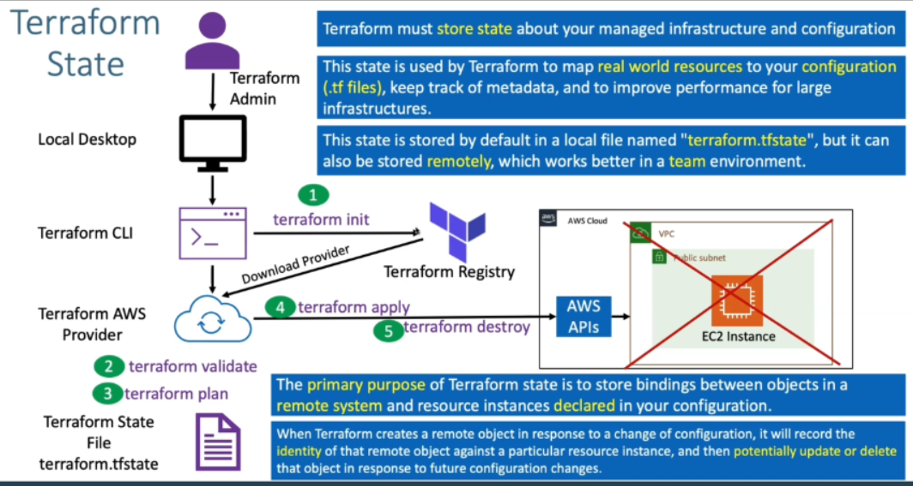

# Topics
1. Basic workflow
2. Providers
3. Resources
4. Variables
5. Datasources
6. State
7. Workspaces
8. Modules
9. Cloud
10. Sentinel
11. State Import
12. Graph
13. Expressions

 ## Terraform workflow
 1. init
 2. validate
 3. plan
 4. apply
 5. destroy

  

## Terraform Language Basics (Configuration syntax)
1. Blocks
2. Arguments
3. Identifiers
4. Comments

### **Terraform Blocks**
  

## Providers
Each resource type is implemented by a provider, which is a plugin for Terraform that offers a collection of resource types. A provider usually provides resources to manage a single cloud or on-premises infrastructure platform. Providers are distributed separately from Terraform itself, but Terraform can automatically install most providers when initializing a working directory.
  

## Terraform resources
Each resource is associated with a single resource type, which determines the kind of infrastructure object it manages and what arguments and other attributes the resource supports.
  

## Terraform State File
Terraform must store state about your managed infrastructure and configuration. This state is used by Terraform to map real world resources to your configuration, keep track of metadata, and to improve performance for large infrastructures.

This state is stored by default in a local file named "terraform.tfstate", but it can also be stored remotely, which works better in a team environment.
    

## Terraform Remote state File with State Locking

  

## Terraform Commands - State Perspective

  

## Type of Provisioners

  

## Terraform Modules

  

## Terraform workflow

  

## Terraform expression

  

/ 
